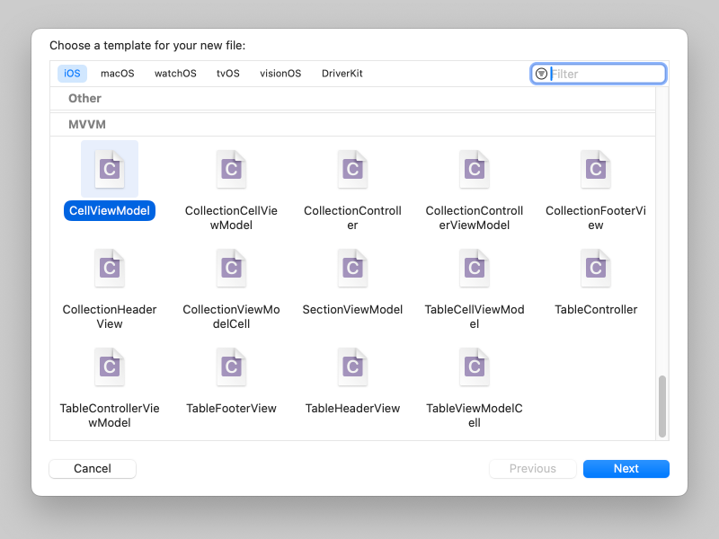

# ViewModel

[](https://travis-ci.org/ItghostFans/ViewModel)
[](https://cocoapods.org/pods/ViewModel)
[](https://cocoapods.org/pods/ViewModel)
[](https://cocoapods.org/pods/ViewModel)

## Example

To run the example project, clone the repo, and run `pod install` from the Example directory first.

## Requirements

```ruby
pod 'ReactiveObjC'
```

## Installation

ViewModel is available through [CocoaPods](https://cocoapods.org). To install
it, simply add the following line to your Podfile:

```ruby
pod 'ViewModel'
```
## Usage

### Step 1
Copy MVVM templates ```Resources/Templates``` to Xcode template directory ```/Applications/Xcode.app/Contents/Developer/Platforms/iPhoneOS.platform/Developer/Library/Xcode/Templates/File Templates/iOS/MVVM```.

### Step 2
Create Controller/Cell/ViewModel etc from MVVM templates.


Just fill **class prefix** to create subclass.


Last write your business code.

## Code

### CellViewModel
CellViewModel is abstract logical class for **TableCellViewModel**&**CollectionCellViewModel**.

It forward invocation to real CellViewModel **tableCellViewModel** or **collectionCellViewModel**.
```Objective-C
@interface ExampleCellViewModel ()

#if __has_include("ExampleTableCellViewModel.h")
@property (strong, nonatomic) ExampleTableCellViewModel *tableCellViewModel;
#endif // #if __has_include("ExampleTableCellViewModel.h")

#if __has_include("ExampleCollectionCellViewModel.h")
@property (strong, nonatomic) ExampleCollectionCellViewModel *collectionCellViewModel;
#endif // #if __has_include("ExampleCollectionCellViewModel.h")

@end

@implementation ExampleCellViewModel

#pragma mark - Fowarding

- (NSMethodSignature *)methodSignatureForSelector:(SEL)aSelector {
    NSMethodSignature *methodSignature = nil;
#if __has_include("ExampleTableCellViewModel.h")
    if ([_tableCellViewModel respondsToSelector:aSelector]) {
        methodSignature = [ExampleTableCellViewModel instanceMethodSignatureForSelector:aSelector];
    }
#endif // #if __has_include("ExampleTableCellViewModel.h")
    
#if __has_include("ExampleCollectionCellViewModel.h")
    if ([_collectionCellViewModel respondsToSelector:aSelector]) {
        methodSignature = [ExampleCollectionCellViewModel instanceMethodSignatureForSelector:aSelector];
    }
#endif // #if __has_include("ExampleCollectionCellViewModel.h")
    return methodSignature;
}

- (void)forwardInvocation:(NSInvocation *)anInvocation {
#if __has_include("ExampleTableCellViewModel.h")
    if ([_tableCellViewModel respondsToSelector:anInvocation.selector]) {
        [anInvocation invokeWithTarget:_tableCellViewModel];
        return;
    }
#endif // #if __has_include("ExampleTableCellViewModel.h")
    
#if __has_include("ExampleCollectionCellViewModel.h")
    if ([_collectionCellViewModel respondsToSelector:anInvocation.selector]) {
        [anInvocation invokeWithTarget:_collectionCellViewModel];
        return;
    }
#endif // #if __has_include("ExampleCollectionCellViewModel.h")
}

@end
```

Why class CellViewModel exist? That is easy to switching UI between UITableView & UICollectionView. Logical code write here without double in UITableViewCell & UICollectionViewCell.

Cell class of CellViewModel. **TableViewModelCell** for **UITableView** forward to _tableCellViewModel, **CollectionViewModelCell** for **UICollectionView** forward to _collectionCellViewModel.


### TableViewModelCell
CellViewModel of TableViewModelCell.

It is important to define actual TableViewModelCell for performance.
```Objective-C
@implementation ExampleTableCellViewModel

- (Class)tableCellClass {
    return ExampleTableViewModelCell.class;
}

@end
```

Cell class to bind logic viewModel by **[TableViewModelCell setViewModel:]**.

ViewModel may be an instance of CellViewModel wrapper.

UITableViewCell height calculate by **[TableViewModelCell heightForWidth:viewModel:]**. Cell height can dynamic calculate from viewModel. Just calculate once for width that cell height cache for key width.
```Objective-C
@implementation ExampleTableViewModelCell

- (void)setViewModel:(ExampleTableCellViewModel *)viewModel {
    BOOL same = self.viewModel == viewModel;
    [super setViewModel:viewModel];
    if (same) {
        // 防止这里不必要的UI刷新。
        return;
    }
}

#pragma mark - TableViewModelCell

+ (CGFloat)heightForWidth:(CGFloat *)width viewModel:(ExampleTableCellViewModel *)viewModel {
    NSAssert(NO, @"%@ %s Should Implement By Subclass!", NSStringFromClass(self.class), __FUNCTION__);
    return 0.0f;
}

@end
```

### CollectionViewModelCell
CellViewModel of CollectionViewModelCell.

The same as TableViewModelCell.
```Objective-C
@implementation ExampleCollectionCellViewModel

- (Class)collectionCellClass {
    return ExampleCollectionViewModelCell.class;
}

@end
```

Cell class to bind logic viewModel by **[CollectionViewModelCell setViewModel:]**.

ViewModel may be an instance of CellViewModel wrapper.

CollectionViewModelCell size calculate by **[TableViewModelCell heightForWidth:viewModel:]**. Cell size can dynamic calculate from viewModel. Just calculate once for size that cell size cache for key size.
```Objective-C
@implementation ExampleCollectionViewModelCell

- (void)setViewModel:(ExampleCollectionCellViewModel *)viewModel {
    BOOL same = self.viewModel == viewModel;
    [super setViewModel:viewModel];
    if (same) {
        // 防止这里不必要的UI刷新。
        return;
    }
}

#pragma mark - CollectionViewModelCell

+ (CGSize)cellSizeForSize:(CGSize *)size viewModel:(ExampleCollectionCellViewModel *)viewModel {
    NSAssert(NO, @"%@ %s Should Implement By Subclass!", NSStringFromClass(self.class), __FUNCTION__);
    return CGSizeZero;
}

@end
```

### SectionViewModel
SectionViewModel is a logical class for UITableView section.

It is look like CellViewModel very much but no need to subclassing SectionViewModel that not customizing section header/footer.

```Objective-C
@implementation ExampleSectionViewModel

#pragma mark - TableView

- (Class)tableHeaderClass {
    return ExampleTableHeaderView.class;
}

- (Class)tableFooterClass {
    return ExampleTableFooterView.class;
}

#pragma mark - CollectionView

- (Class)collectionHeaderClass {
    return ExampleCollectionHeaderView.class;
}

- (Class)collectionFooterClass {
    return ExampleCollectionFooterView.class;
}

@end
```

### TableViewModel & CollectionViewModel
The MVVM core implementation for UITableView&UICollectionView.

They base on KVO, abstract NSArray action map to view interaction.

```Objective-C
{
    SectionViewModel *sectionViewModel = SectionViewModel.new;
    sectionViewModel.collectionMinimumLineSpacing = 5.0f;
    sectionViewModel.collectionMinimumInteritemSpacing = 10.0f;

    for (NSInteger index = 0; index < 100; ++index) {   // Add 100 Cell.
        [sectionViewModel addViewModel:ExampleCellViewModel.new];
    }

    // TableView
    {
        TableViewModel *tableViewModel = TableViewModel.new;
        [tableViewModel.sectionViewModels addViewModel:sectionViewModel];
        TableControllerViewModel *controllerViewModel = [[TableControllerViewModel alloc] initWithTableViewModel:viewModel];
        TableController *tableController = TableController.new;
        tableController.viewModel = controllerViewModel;
        [controller.view addSubview:controller.tableView];
        controller.tableView.frame = controller.view.bounds;
        controller.viewModel.tableViewModel.tableView = controller.tableView;
        [controller.tableView performBatchUpdates:^{
            // Dynamic add/insert/delete/move with animation
            [sectionViewModel addViewModel:ExampleCellViewModel.new];
        } rowAnimation:(UITableViewRowAnimationLeft) completion:^(BOOL finished) {
        }];
    }

    // CollectionView
    {
        CollectionViewModel *collectionViewModel = CollectionViewModel.new;
        [collectionViewModel.sectionViewModels addViewModel:sectionViewModel];
        CollectionControllerViewModel *controllerViewModel = [[CollectionControllerViewModel alloc] initWithCollectionViewModel:collectionViewModel];
        CollectionController *controller = CollectionController.new;
        controller.viewModel = controllerViewModel;
        [controller.view addSubview:controller.collectionView];
        controller.collectionView.frame = controller.view.bounds;
        controller.viewModel.collectionViewModel.collectionView = self.collectionView;
        [controller.collectionView performBatchUpdates:^{
            // Dynamic add/insert/delete/move with animation
            [sectionViewModel insertViewModel:TestCellViewModel.new atIndex:0];
        } completion:^(BOOL finished) {
            [UIView setAnimationsEnabled:YES];
        }];
    }
}
```

More usage for reading Example code.

## Author

ItghostFan, ItghostFans@gmail.com

## License

ViewModel is available under the MIT license. See the LICENSE file for more info.
